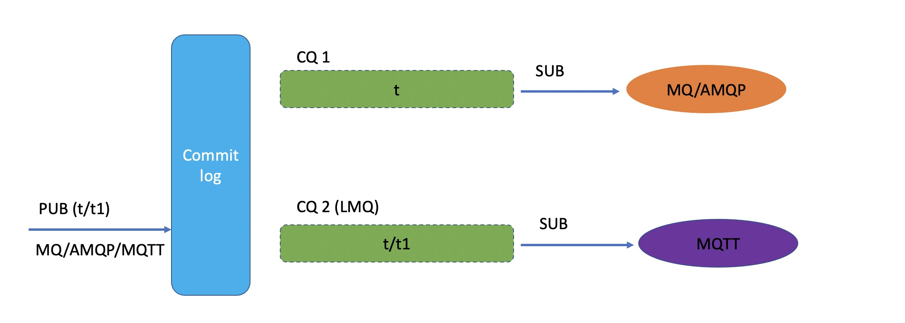

# Light message queue (LMQ)

LMQ采用的读放大的策略，写一份数据，多个LMQ队列分发， 因为存储的成本和效率对用户的体感最明显。写多份不仅加大了存储成本，同时也对性能和数据准确一致性提出了挑战。



上图描述的是LMQ的队列存储模型，消息可以来自各个接入场景
（如服务端的MQ/AMQP，客户端的MQTT），但只会写一份存到commitlog里面，然后分发出多个需求场景的队列索引（ConsumerQueue），如服务端场景（MQ/AMQP）可以按照一级Topic队列进行传统的服务端消费，客户端MQTT场景可以按照MQTT多级Topic(
也即 LMQ)进行消费消息。

## 一、broker启动配置

broker.conf文件需要增加以下的配置项，开启LMQ开关，这样就可以识别LMQ相关属性的消息，进行原子分发消息到LMQ队列

```properties
enableLmq = true
enableMultiDispatch = true
```

## 二、发送消息

发送消息的时候通过设置 INNER_MULTI_DISPATCH 属性，LMQ queue使用逗号分割，queue前缀必须是 %LMQ%，这样broker就可以识别LMQ queue. 以下代码只是demo伪代码 具体逻辑参照执行即可

```java
DefaultMQProducer producer = new DefaultMQProducer("please_rename_unique_group_name");
producer.setNamesrvAddr("name-server1-ip:9876;name-server2-ip:9876");
producer.start();


/*
* Create a message instance, specifying topic, tag and message body.
*/
Message msg = new Message("TopicTest" /* Topic */,
                          "TagA" /* Tag */,
                          ("Hello RocketMQ " + i).getBytes(RemotingHelper.DEFAULT_CHARSET) /* Message body */
                         );
/*
* INNER_MULTI_DISPATCH property and PREFIX must start as "%LMQ%",
* If it is multiple LMQ, need to use “,” split
*/
message.putUserProperty("INNER_MULTI_DISPATCH", "%LMQ%123,%LMQ%456");
/*
* Call send message to deliver message to one of brokers.
*/
SendResult sendResult = producer.send(msg);
```

## 三、拉取消息

LMQ queue在每个broker上只有一个queue，也即queueId为0， 指明轻量级的MessageQueue，就可以拉取消息进行消费。 以下代码只是demo伪代码 具体逻辑参照执行即可

```java
DefaultMQPullConsumer defaultMQPullConsumer = new DefaultMQPullConsumer();
defaultMQPullConsumer.setNamesrvAddr("name-server1-ip:9876;name-server2-ip:9876");
defaultMQPullConsumer.setVipChannelEnabled(false);
defaultMQPullConsumer.setConsumerGroup("CID_RMQ_SYS_LMQ_TEST");
defaultMQPullConsumer.setInstanceName("CID_RMQ_SYS_LMQ_TEST");
defaultMQPullConsumer.setRegisterTopics(new HashSet<>(Arrays.asList("TopicTest")));
defaultMQPullConsumer.setBrokerSuspendMaxTimeMillis(2000);
defaultMQPullConsumer.setConsumerTimeoutMillisWhenSuspend(3000);
defaultMQPullConsumer.start();

String brokerName = "set broker Name";
MessageQueue mq = new MessageQueue("%LMQ%123", brokerName, 0);
defaultMQPullConsumer.getDefaultMQPullConsumerImpl().getRebalanceImpl().getmQClientFactory().updateTopicRouteInfoFromNameServer("TopicTest");

Thread.sleep(30000);
Long offset = defaultMQPullConsumer.maxOffset(mq);

defaultMQPullConsumer.pullBlockIfNotFound(
                mq, "*", offset, 32,
                new PullCallback() {
                    @Override
                    public void onSuccess(PullResult pullResult) {
                        List<MessageExt> list = pullResult.getMsgFoundList();
                        if (list == null || list.isEmpty()) {
                            return;
                        }
                        for (MessageExt messageExt : list) {
                            System.out.println(messageExt);
                        }    
                    }
                    @Override
                    public void onException(Throwable e) {
                       
                    }
});
```

​

